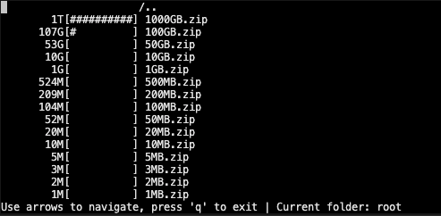

# Curses FTP Drive Usage

A terminal application to display FTP server file space usage inspired from ncdu.

## Dependencies

Python 3 with the following packages:

*   hurry.filesize

## Installation

*   Install the dependencies, for example with a conda environment using the `environment.yml` file

    `conda env create -f environment.yml`

## Usage

*   Run the `cfdu.py` script and give your FTP server credentials as arguments
    (run `cfdu.py -h` to display the list of arguments)
*   Wait until scanning is over
*   Navigate with arrows, press 'q' to exit

## Todo

*   Add header and update footer
*   Refactoring create custom ftp and sftp classes
